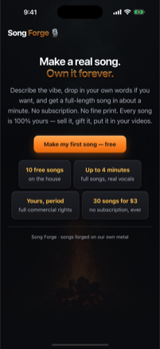
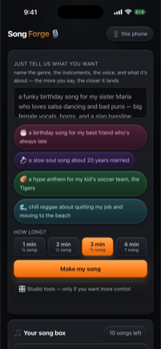
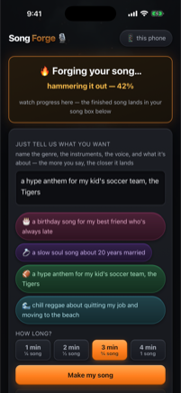
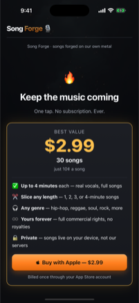

# 🎙 Song Forge

### Type a vibe. Get a whole song.

No big-tech AI cloud, no subscription, no API keys. Songs render on my own hardware.

###   

**Get Song Forge on [iPhone](https://apps.apple.com/us/app/id6788616929) or [Android](https://play.google.com/store/apps/details?id=com.nicedreamz.ownatune)**: free, 10 songs on the house. No subscription, no account, no email.

   

**Song Forge turns a one-line description into a finished song with lyrics, music and vocals.**

Song Forge is a native **iPhone (Apple) and Android (Google) app**. Describe a song, like *"sunset reggae with steel pan, 78 bpm"*, and Song Forge writes the lyrics, composes the music and vocals, and hands you a finished track. Drop in a 10-second voice sample and it'll re-sing the song in that voice. The phone sends your prompt to my own Mac render server (see [PRIVACY.md](PRIVACY.md)); no third-party AI API is involved.

## 🛠 What I built (Matt Macosko)

- **Render server** [`ios/forge_server.py`](ios/forge_server.py): a standard-library Python HTTP server that takes an idea, writes lyrics, queues the song on ACE-Step, saves and tags the result, and serves the web UI and JSON API (`/api/song`, `/api/status`, `/api/songs`, `/api/voices`, ...).
- **Lyric writing with guardrails** (`_llm_lyrics` in [`forge_server.py`](ios/forge_server.py)): prompts a local Gemma model, rejects output containing banned phrases, retries, and falls back to generated seed lyrics.
- **Karaoke lyric timing** (`_align_lyrics`): runs Whisper for word timestamps, then fuzzy-matches the written lyrics to what was actually sung, so the on-screen lines stay in sync without showing Whisper's mishearings.
- **Voice-swap pipeline** (`_run_swap_impl`): Demucs vocal split, seed-vc voice conversion, then an ffmpeg remix, run as a background job with stage-aware progress.
- **Genre-aware vocal prompting**: per-genre vocal cues and auto voice assist for gospel, soul, hip-hop, reggae and more, to push back on the model defaulting every genre to the same pop voice.
- **Web UI** [`ios/index.html`](ios/index.html) and the audio-reactive Three.js visualizer [`ios/viz3d.js`](ios/viz3d.js).
- **Launch tooling** [`ios/forge_supervisor.sh`](ios/forge_supervisor.sh) and [`ios/launch.applescript`](ios/launch.applescript): boots ACE-Step and the server idempotently and opens the UI.
- **Android app** [`MainActivity.kt`](android/app/src/main/java/com/nicedreamz/ownatune/MainActivity.kt): WebView shell with a remote URL pointer file and fallback domain, per-install random ID, a JS bridge shim matching the iOS `webkit.messageHandlers` convention, and native song downloads through DownloadManager. R8 keep rules for the JS bridge are in [`proguard-rules.pro`](android/app/proguard-rules.pro).

**Upstream, not mine:** ACE-Step (music), seed-vc (voice conversion), Whisper (timing), Gemma (lyrics, served through LM Studio), MLX, Demucs, ffmpeg and Three.js. See [CREDITS.md](CREDITS.md).

This repo holds both platforms, cleanly separated:

## 📱 iOS

The local Mac render engine (`forge_server.py`, `forge_supervisor.sh`) that powers the apps, its web UI, and App Store screenshots in [`ios/docs/appstore/`](ios/docs/appstore/). Source in [`ios/`](ios/). The native iPhone wrapper (Swift) is not in this repo.

**Status:** ✅ **Live on the App Store and Google Play**: [iPhone](https://apps.apple.com/us/app/id6788616929) · [Android](https://play.google.com/store/apps/details?id=com.nicedreamz.ownatune).

**Running the render server yourself** (what the code expects):

- An Apple Silicon Mac. Paths are hardcoded to `~/Desktop/PROJECTS/Song Forge` in the supervisor and AppleScript.
- ACE-Step 1.5 checked out at `engines/ACE-Step-1.5` (API on port 8001) and seed-vc at `engines/seed-vc` with its own `.venv`. Engines are not included (see `.gitignore`).
- LM Studio serving Gemma at `http://127.0.0.1:1234`, plus `ffmpeg`, `demucs` and `mlx_whisper` installed.
- Then run `bash ios/forge_supervisor.sh` (or `python3 ios/forge_server.py` directly) and open `http://127.0.0.1:8767/`.

If LM Studio is down, lyrics fall back to simple generated seed lyrics. Publishing to the public site relies on a private `~/Scripts/songs_sync.py` that is not in this repo, so auto-publish is disabled without it.

## 🤖 Android

The Android port. Source in [`android/`](android/). Build with `cd android && ./gradlew assembleDebug` (JDK 17, compileSdk 35).

**Status:** ✅ [Live on Google Play](https://play.google.com/store/apps/details?id=com.nicedreamz.ownatune).

**Not done yet:** in-app purchases on Android. The `buy()` bridge in `MainActivity.kt` is a stub that shows a "coming soon" notice; Google Play Billing is not wired up.

## Links

- Product page: https://nicedreamzwholesale.com/software/song-forge/
- Questions or bugs? **info@nicedreamzwholesale.com**
